- [Go back to main](/README.md)
# Lab 1

We will create a VCN.

## What is virtual Cloud Networks?

### Introduction: 

Oracle Cloud Infrastructure Compute lets you create multiple Virtual Cloud Networks (VCNs). These VCNs will contain the security lists, compute instances, load balancers and many other types of network assets.

Be sure to review Overview of Networking to gain a full understanding of the network components and their relationships, or take a look at this [video](/https://www.youtube.com/embed/mIYSgeX5FkM) 

#### Create VCN

Steps needed here..

#### Create Your VCN using wizard

To create a VCN on Oracle Cloud Infrastructure:

On the Oracle Cloud Infrastructure Console Home page, under the Quick Actions header, click on **Set up a network with a wizard**.

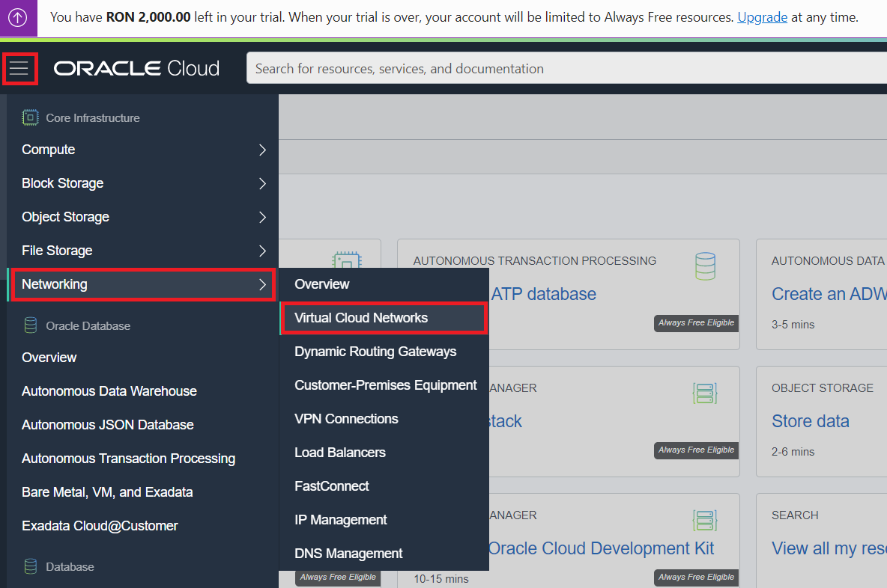

Complete the following fields selecting your Root compartment:

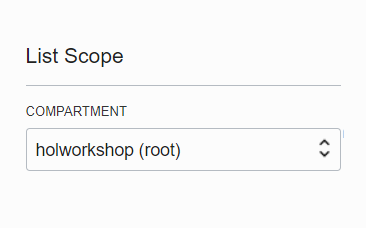

Select VCN with Internet Connectivity, and then click **Start VCN Wizard**.

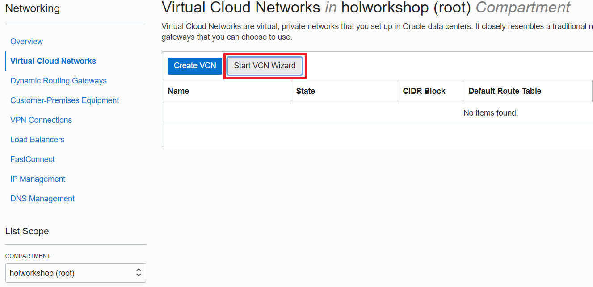

Select VCN with Internet Connectivity, and then click **Start VCN Wizard**.

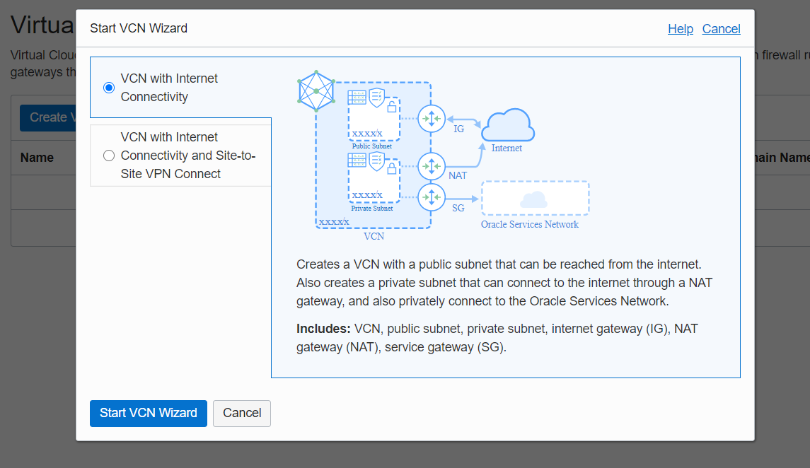

Select VCN with Internet Connectivity, and then click **Start VCN Wizard**.

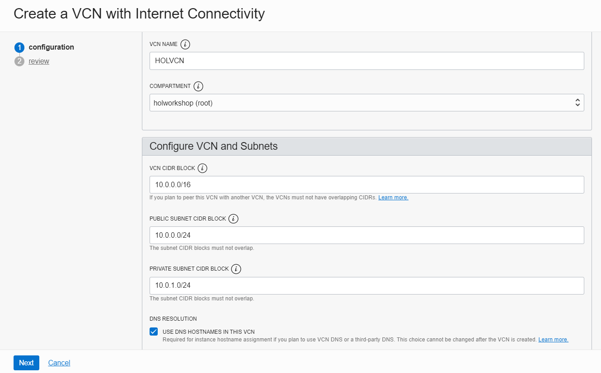

Select VCN with Internet Connectivity, and then click **Start VCN Wizard**.

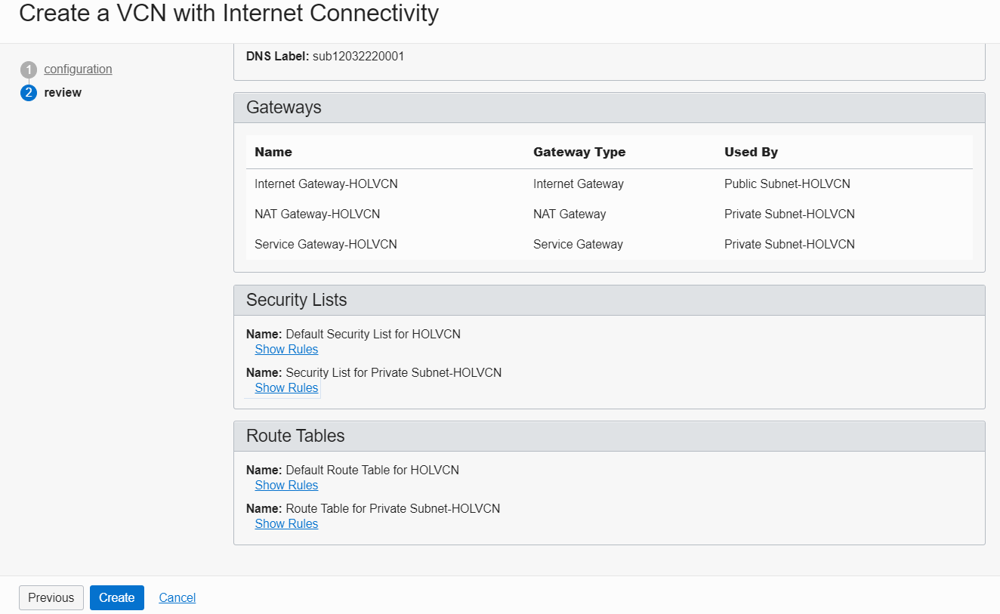

Select VCN with Internet Connectivity, and then click **Start VCN Wizard**.

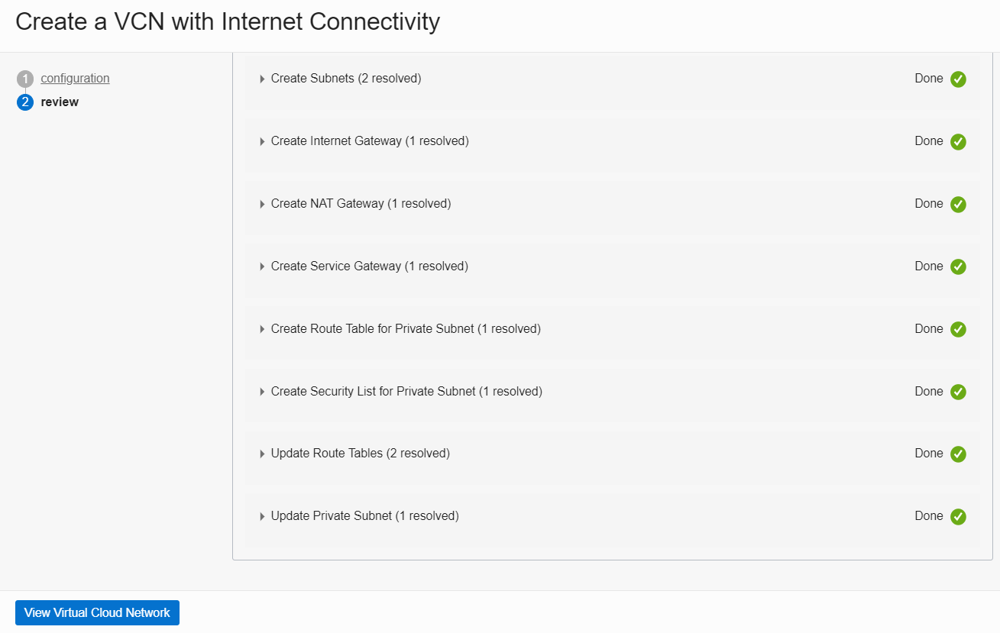

Press the **Next** button at the bottom of the screen.
 
Review your settings to be sure they are correct.
 
 
Press the **Create** button to create the VCN. It will take a moment to create the VCN and a progress screen will keep you apprised of the workflow.
 
 
Once you see that the creation is complete (see previous screenshot), click on the **View Virtual Cloud Network** button.

## Part 2. Adding security rules

Explanation

#### Ingress ...

necessary ports 

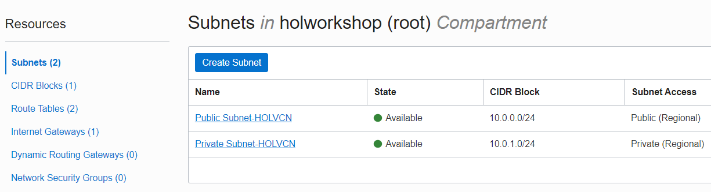

necessary ports 

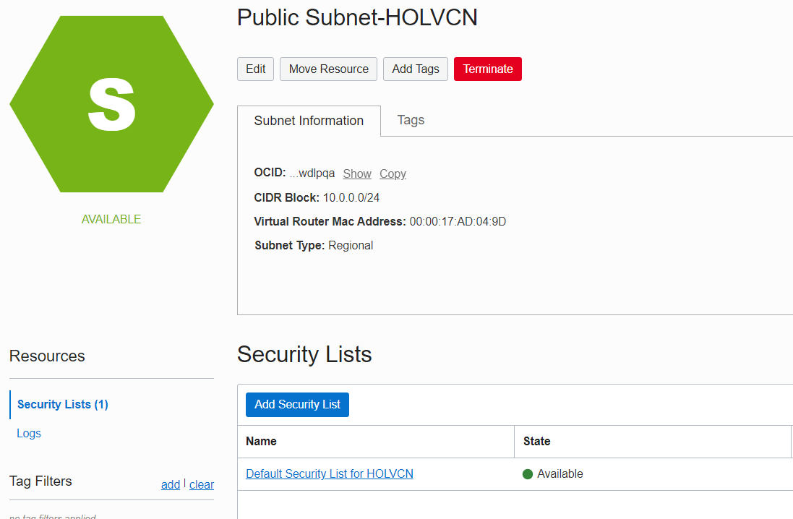

necessary ports 

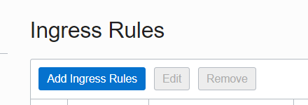

necessary ports 

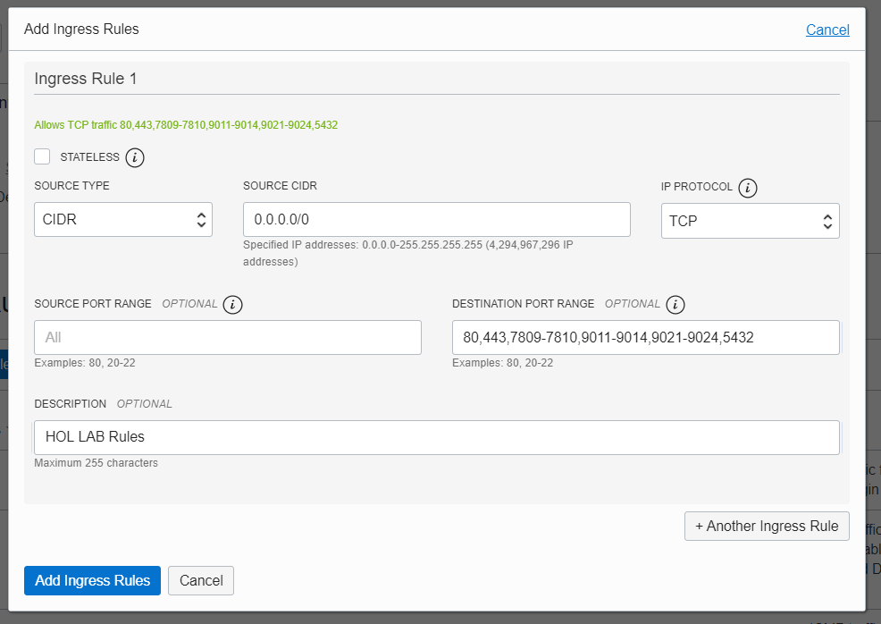

necessary ports 

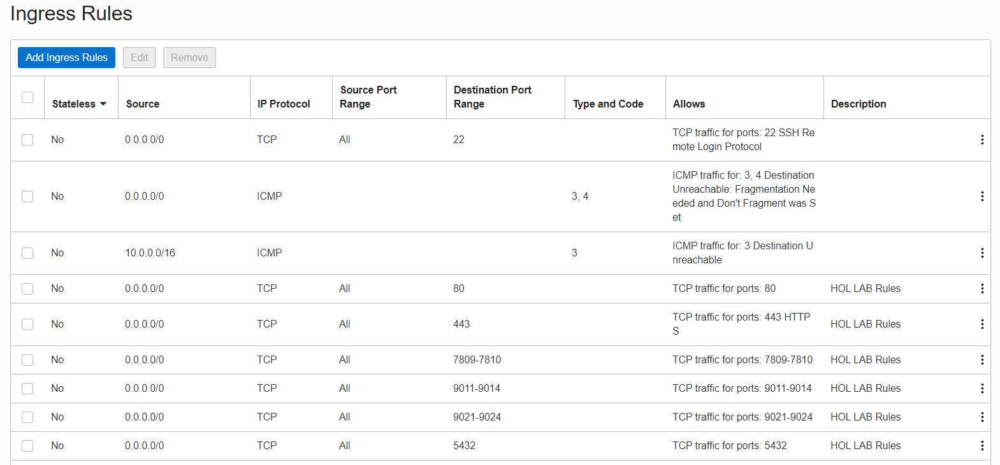

necessary ports 

#### Summary
This VCN will contain all of the other assets that you will create during this set of labs. In real-world situations, you would create multiple VCNs based on their need for access (which ports to open) and who can access them.
 

- [Go to next lab 2](/gglab/step2.md)
