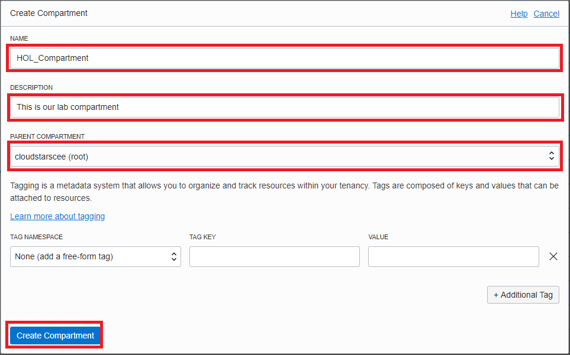

================= JC CHANGES were here

- [Go back to main](/README.md)
# Lab 1

We will create Compartment and VCN ...

A compartment is a collection of cloud assets, like compute instances, load balancers, databases, etc. By default, a root compartment was created for you when you created your tenancy (ie when you registered for the trial account). It is possible to create everything in the root compartment, but Oracle recommends that you create sub-compartments to help manage your resources more efficiently.
<<<<<<< main

## Step 1: Create Compartment 

1. From the menu, select **Identity** then **Compartments**. 

2. Click on the blue **Create Compartment**button to create a sub-compartment under your root compartment. You will have different name than in example.

3. Provide your name and description for your compartment...

## Step 2: Create VCN

Steps needed here..

- [Go back to Next step](/gglab/step2.md)
=======
 
 
 
 
Virtual Cloud Networks

Introduction: 

Oracle Cloud Infrastructure Compute lets you create multiple Virtual Cloud Networks (VCNs). These VCNs will contain the security lists, compute instances, load balancers and many other types of network assets.

Be sure to review Overview of Networking to gain a full understanding of the network components and their relationships, or take a look at this video:

<iframe width="553" height="341" src="https://www.youtube.com/embed/mIYSgeX5FkM" frameborder="0" allow="accelerometer; autoplay; clipboard-write; encrypted-media; gyroscope; picture-in-picture" allowfullscreen></iframe> 

Prerequisites

To sign in to the Console, you need the following:

Tenant, User name and Password

URL for the Console: https://console.us-ashburn-1.oraclecloud.com/

Oracle Cloud Infrastructure supports the latest versions of Google Chrome, Firefox and Internet Explorer 11. It does not support the Edge browser.

STEP 1: Create Your VCN 

To create a VCN on Oracle Cloud Infrastructure:

1. On the Oracle Cloud Infrastructure Console Home page, under the Quick Actions header, click on Set up a network with a wizard.
https://oracle.github.io/learning-library/oci-library/oci-hol/virtual-cloud-networks/images/setupVCN1.png

2. Select VCN with Internet Connectivity, and then click Start VCN Wizard.
https://oracle.github.io/learning-library/oci-library/oci-hol/virtual-cloud-networks/images/setupVCN2.png

3.Complete the following fields selecting your Root compartment:
>>>>>>> lab-1-JC

