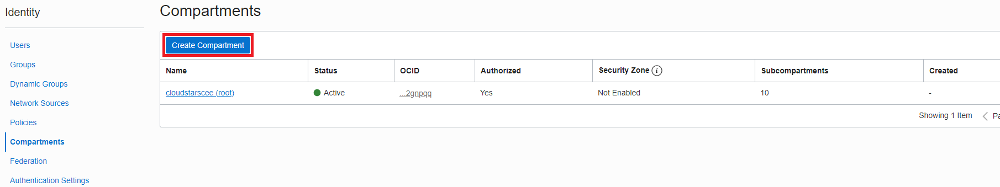

- [Go back to main](/README.md)
# Lab 1

We will create Compartment and VCN ...

A compartment is a collection of cloud assets, like compute instances, load balancers, databases, etc. By default, a root compartment was created for you when you created your tenancy (ie when you registered for the trial account). It is possible to create everything in the root compartment, but Oracle recommends that you create sub-compartments to help manage your resources more efficiently.

## Step 1: Create Compartment 

1. From the menu, select **Identity** then **Compartments**. 

2. Click on the blue **Create Compartment**button to create a sub-compartment under your root compartment. You will have different name than in example.

3. Provide your name and description for your compartment...

## Step 2: Create VCN

Steps needed here..

- [Go back to Next step](/gglab/step2.md)
