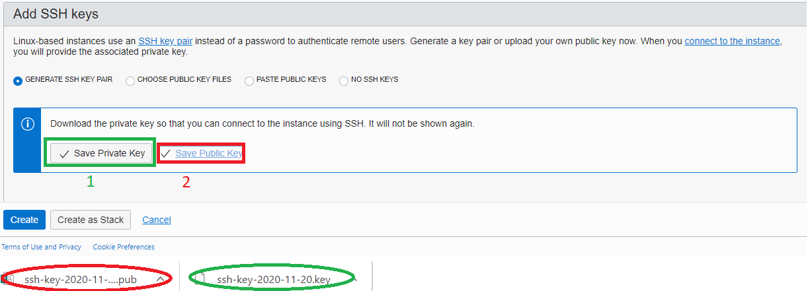
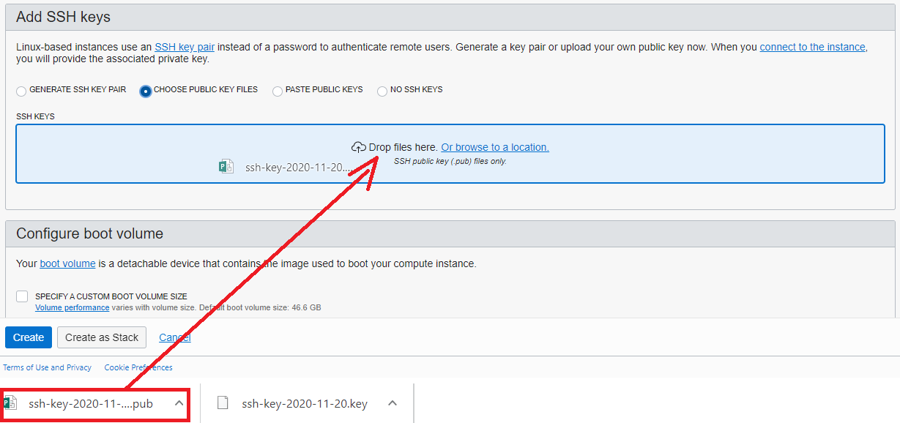
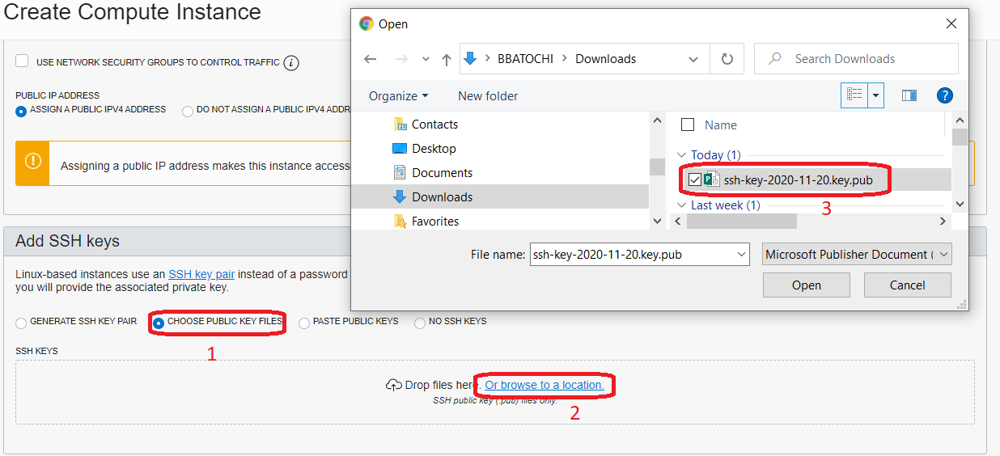

- [Go back to main](/README.md)
- [Go back to previous step](/gglab/step1.md)

# Lab 2
Oracle Cloud Infrastructure Compute lets you provision and manage compute hosts, known as instances. You can launch instances as needed to meet your compute and application requirements. After you launch an instance, you can access it securely from your computer, restart it, attach and detach volumes, and terminate it when you're done with it. Any changes made to the instance's local drives are lost when you terminate it. Any saved changes to volumes attached to the instance are retained.

## Step 1: Create SSH Keys Using Oracle Cloud Shell
The SSH (Secure Shell) protocol is a method for secure remote login from one computer to another. SSH enables secure system administration and file transfers over insecure networks using encryption to secure the connections between endpoints. SSH keys are an important part of securely accessing Oracle Cloud Infrastructure compute instances in the cloud.
The Cloud Shell machine is a small virtual machine running a Bash shell which you access through the OCI Console (Homepage). Cloud Shell comes with a pre-authenticated OCI CLI (Command Line Interface), set to the Console tenancy home page region, as well as up-to-date tools and utilities. To use the Cloud Shell machine, your tenancy administrator must grant the required IAM (Identity and Access Management) policy.

- To start the Oracle Cloud shell, go to your Cloud console and click the cloud shell icon at the top right of the page.


- Once the cloud shell has started, enter the following command. Identify your directory and create .ssh directory and go inside.


- Enter the following command to create your ssh private and public key files.
```
ssh-keygen -b 2048 -t rsa -f id_rsa
```

Choose the key name you can remember. I gave "id_rsa" and this will be the keyname I will use it later to connect to my compute instances. Press Enter twice for no passphrase.


- Note in the output that there are two files, a private key: id_rsa and a public key: id_rsa.pub. Keep the private key safe and don't share its content with anyone. The public key will be needed for various activities and can be uploaded to certain systems as well as copied and pasted to facilitate secure communications in the cloud. Copy "id_rsa.pub" file


Go to the OCI console. From OCI services menu, under Compute, click Instances.

## Step 2. Create your PostgreSQLDB instance

- Click Create Instance. Fill out the dialog box:
    **Name your instance**: Enter a name
    **Create in Compartment**: Choose the same compartment you used to create the VCN
    


## 2. Choose AD 
- Choose your AD, some may see only one AD depending on your region and click on "Change Image", we will choose Ubuntu...


## 3. Change image 
- Any Ubuntu version should work, but stick to 18.04


## 4. step name
- Choose from available shapes for your tenancy. maybe more image needed here... will confirm


## 5. Select VCN
- Under Configure Networking:

**Virtual cloud network compartment**: Select your compartment

**Virtual cloud network**: Choose the VCN you created in Step 1

**Subnet Compartment**: Choose your compartment.

**Subnet**: Choose the Public Subnet under Public Subnets

**Use network security groups to control traffic** : Leave un-checked

**Assign a public IP address**: Check this option


## 6. Save SSH Keys
- Save private and public keys.



## 7. Add SSH Keys 
- Click "choose public key files", then drag and drop previously saved public key.



## OR this step 
- Click "choose public key files" then click on "Browse". find your file and upload.



## 8. step 
- show advanced options


## 9. step 
- Choose cloud init script file and upload required file to install postgresql database. You can download it [here](./files/pgsql/ubuntu_cloud_init.sh). Download and save it as ubuntu_cloud_init.sh 


## 10. step 
- Review everything and click on "Create" button.


## 11. Wait for Instance to be in Running state
- It will take 1-2 minutes..


## 12. step 
- Open git bash and check your connection to public IP address. Issue:
```
   ssh ubuntu@ip_address -i your_private_key
```
Enter 'yes' when prompted for security message, and enter your passphrase.


Ready.
