- [Go back to main](/)
- [Go back to previous step](step1.md)

# Lab 2
Now let's continue to create your source PostgreSQL database in Oracle Cloud Infrastructure. In order to do so, we would have to create a Compute resource with Ubuntu OS 20.4 version. This lab 2 consists of three small parts.

## Part 1: Create SSH Keys Using Oracle Cloud Shell
The SSH (Secure Shell) protocol is a method for secure remote login from one computer to another. SSH enables secure system administration and file transfers over insecure networks using encryption to secure the connections between endpoints. SSH keys are an important part of securely accessing Oracle Cloud Infrastructure compute instances in the cloud.
The Cloud Shell machine is a small virtual machine running a Bash shell which you access through the OCI Console (Homepage). Cloud Shell comes with a pre-authenticated OCI CLI (Command Line Interface), set to the Console tenancy home page region, as well as up-to-date tools and utilities. To use the Cloud Shell machine, your tenancy administrator must grant the required IAM (Identity and Access Management) policy.

#### To start the Oracle Cloud shell, go to your Cloud console and click the cloud shell icon at the top right of the page.

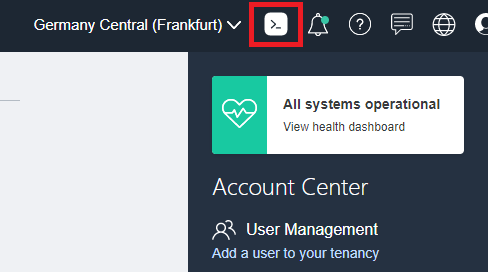

#### Once the cloud shell has started, enter the following command. 

```
pwd
mkdir ~/.ssh
cd ~/.ssh/
```

Identify your directory and create .ssh folder in your home directory, then go inside, where you will create your ssh keys. Use below image as reference.

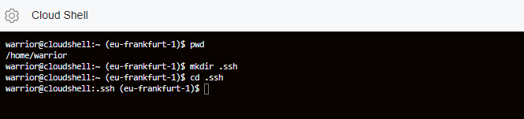

#### Enter the following command to create your ssh private and public key files.
```
ssh-keygen -b 2048 -t rsa -f id_rsa
```

Press Enter twice for no passphrase for prompt. It is entirely up to your choice whether to create it **with** or **without** passphrase.

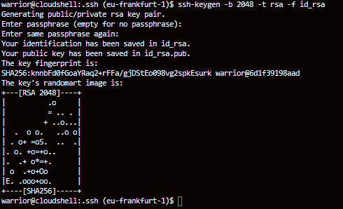

Note in the output that there are two files, a **private key**: id_rsa and a **public key**: id_rsa.pub. Keep the private key safe and don't share its content with anyone. The public key will be needed for various activities and can be uploaded to certain systems as well as copied and pasted to facilitate secure communications in the cloud. Copy content of "id_rsa.pub" by selecting it and right click on your mouse choose copy.

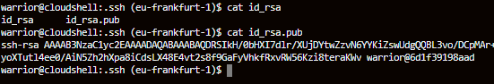

## Part 2. Create your PostgreSQLDB instance

Now let's create our PostgreSQL database in OCI compute service. Launching an instance is simple and intuitive with few options to select. The provisioning of the compute instance will complete in less than a minute and the instance state will change from provisioning to running.

#### Click on hamburger icon in left top corner, navigate to the Compute tab and select Instances. 

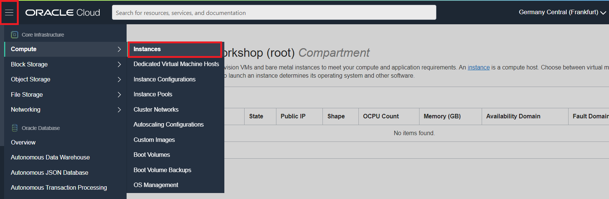

OCI Compute resource lets you provision and manage compute  hosts, known as instances. You can launch as many instances as needed to meet your compute and application requirements.

Provide your name of instance and choose correct compartment in where it will be created.

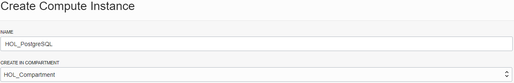

#### Choose your size of compute instance and operating system.

Click on *Edit* as shown below
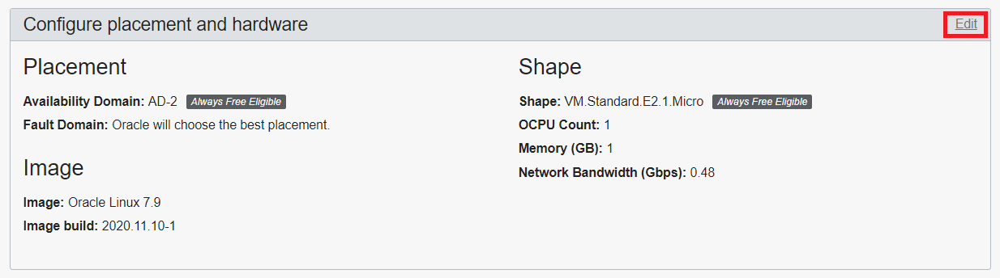

#### Choose your Availability Domain (AD aka available datacentre)

Some may see just one AD depending on regions, however in my case I can see three ADs because my region Germany Frankfurt has 3 ADs.

We will stick to *Always free Eligibile* AD2 for example and click on "Change Image"

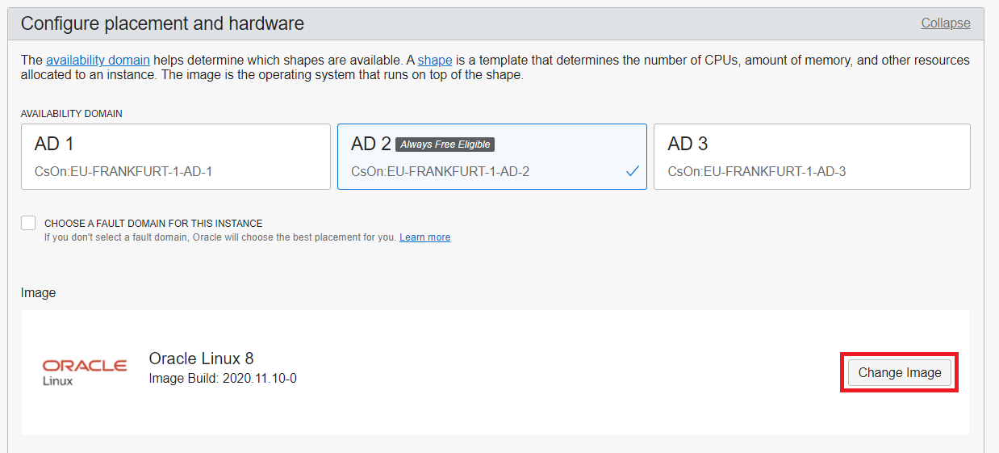

#### Go to Platform Images tab

Choose "Canonical Ubuntu 20.04 *Always Free Eligible"* OS image for this occasion and click on select image. I advise you to choose latest available.

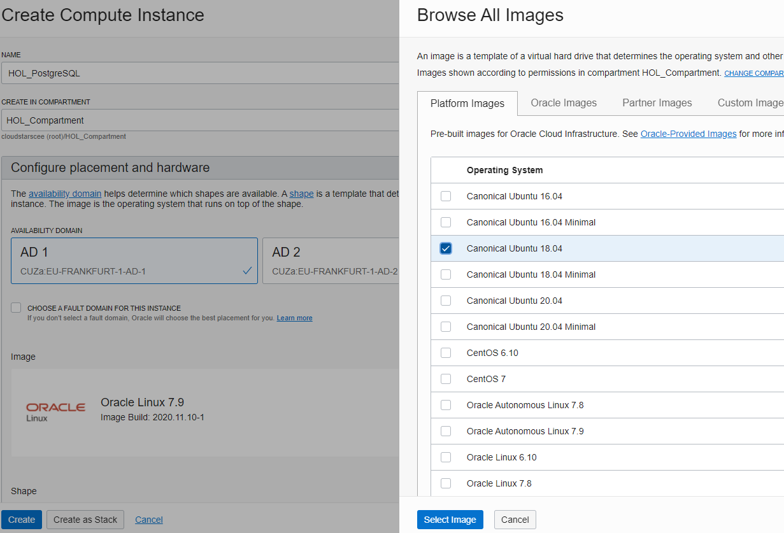

#### Choose your shape 

There are 2 options for choosing your image:
   - Always Free Eligible E2.1.Micro shape, this doesn't charge you anything at all, free for life but little slower than other shapes.
   - Other shapes with higher CPUs, higher memory and higher network bandwidth, costs vary depending on your need.

If you wish to continue with *Always Free* shape don't change shape here.
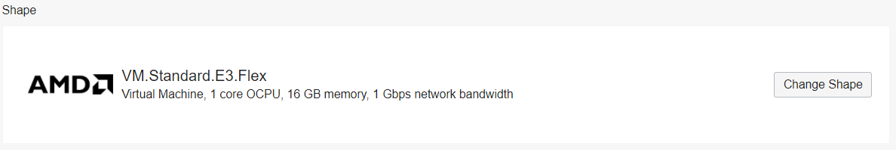

#### Change shape
When you clicked on change shape, you will see **Virtual Machine** options by default. Click on **_Specialty and Legacy_** tab to list all available shapes for your tenancy.

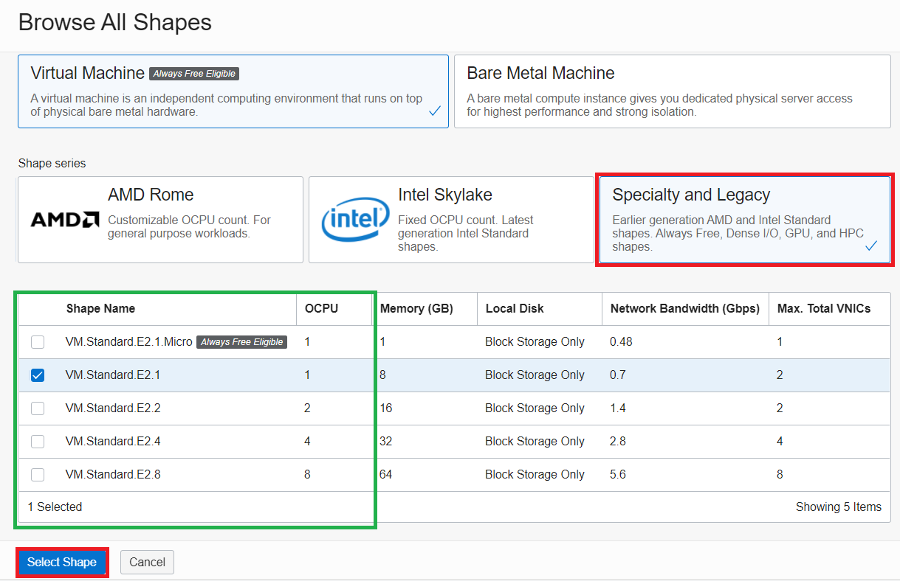


I choose **VM.Standard.E2.1** AMD shape for PostgreSQL DB, since this is for just small demo.


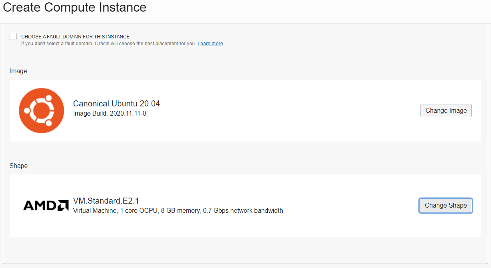

Confirm your selection and go to next configuration.


#### Select VCN
Under Configure Networking, you will see OCI has selected automatically from your available networking options. 
Make sure **Public Subnet** is selected and **Assign a Public IP** option is set to **Yes** here. If they are not, click on *Edit*

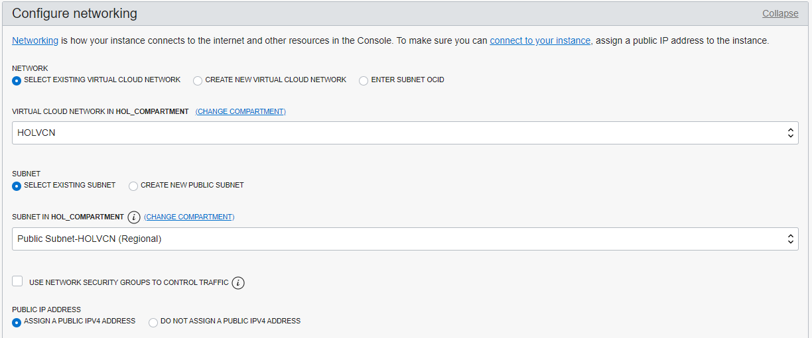

Select correct compartment then choose correct VCN you created in [Lab 1](/gglab/step1.md). Remember to choose **public subnet** and **assign public IP address** in this configuration step.

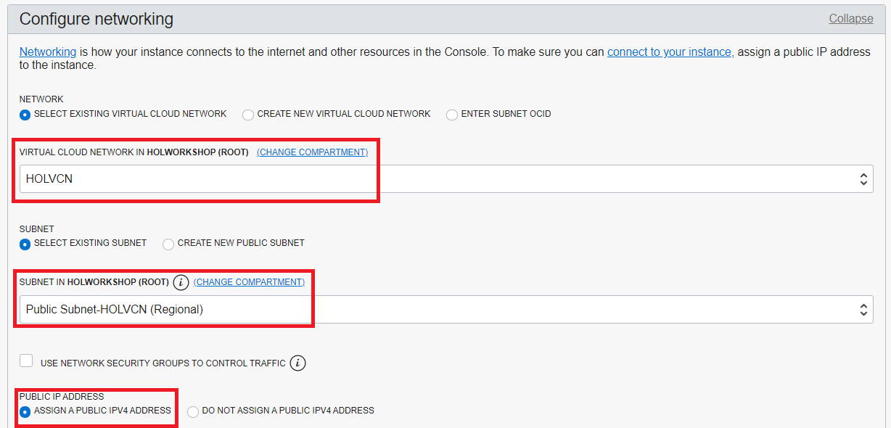

#### Add SSH Keys 

Now you will need previously created public ssh key using CloudShell here. Choose "Paste Public Keys", paste id_rsa.pub file content.

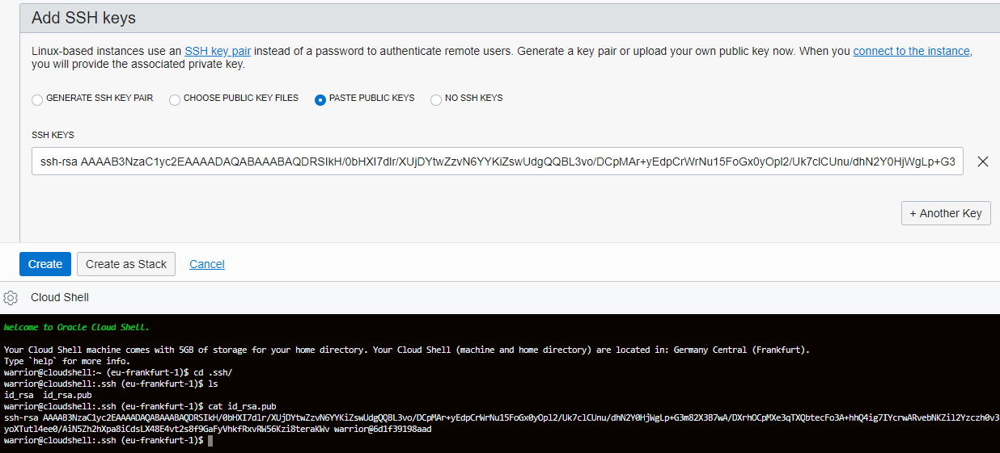

#### One last bit, click to Show Advanced Options 

We are almost done here, but we haven't configured anything about PostgreSQL database, so click on show advanced options and we will add cloud-init file.


You need to download cloud-init file **[from here](./files/pgsql/ubuntu_ParkingData.sh)**. Make sure to save these with correct extension **.sh** not txt!

#### Upload cloud-init file

Go to *Mangement tab* and **Choose cloud-init script file** and upload downloaded ubuntu_ParkingData.sh file, which will install postgresql database during your linux instance creation. 

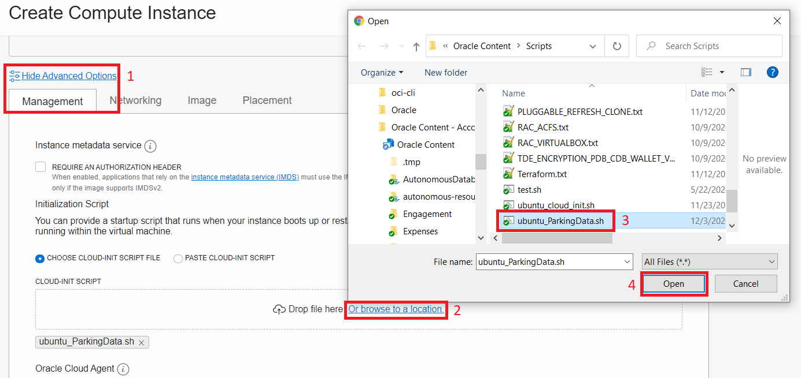

#### Checking it twice

Review everything and click on "Create" button.


_NOTICE: Just in case if you are on running this lab on trial account you might see **Out of capacity for Shape MICRO** warning, it means selected shape has reached to max available limit for your trial usage. I'd advise you to try changing shape to **VM.Standard.E2.1** on step [Change shape](#change-shape)_


#### Wait for Instance to be in Running state
Instance provisioning is very easy in OCI and it it will take around 1-2 minutes to create fully functional your linux instance. Once the instance state changes to Running, you can SSH to the Public IP address of the instance.


After you launch an instance, you can access it securely from your computer or from cloud shell. 

#### Connect to your instance 

After you launch an instance, you can access it securely from your computer or from cloud shell. Let's open cloud shell and test your connection to your new PostgreSQL database you just created.

```
   ssh ubuntu@ip_address -i ~/.ssh/id_rsa
```

Enter 'yes' when prompted for security message, and enter your passphrase.

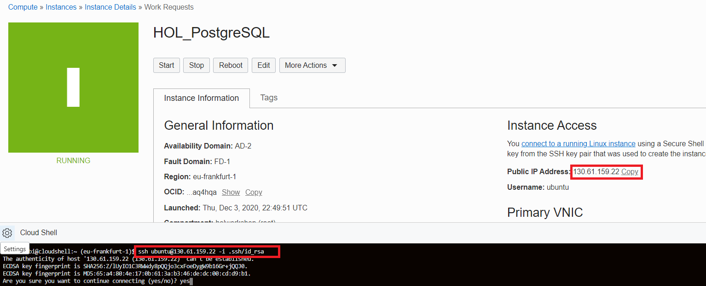

Ubuntu instance is ready, let's continue.

## Part 3. Login to your PostgreSQLDB instance

Remember we did provide cloud-init script before creating instance? Now let's check if it went correctly and created all necessary pre-requisites. Once you are in your VM instance, issue following:
`cat install.log` to see content of cloud-init installation log.

If you are seeing something like this, you are most likely good to go to next lab.

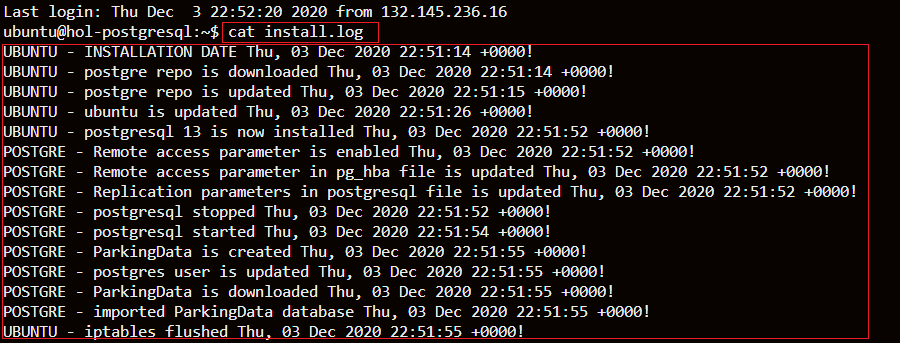

Just in case, let's make sure you have sample data is installed. We will switch to **postgres** user in ubuntu, issue:
`
sudo -i -u postgres
`

Then we will connect to our test source database.
`
psql -d parkingdata
`
Once you are in **psql** terminal you can issue `\z` to list available tables in **parkingdata** database. Run following query.

`select count(*) from public."ParkingData";` 

It should show you a 10000 records.

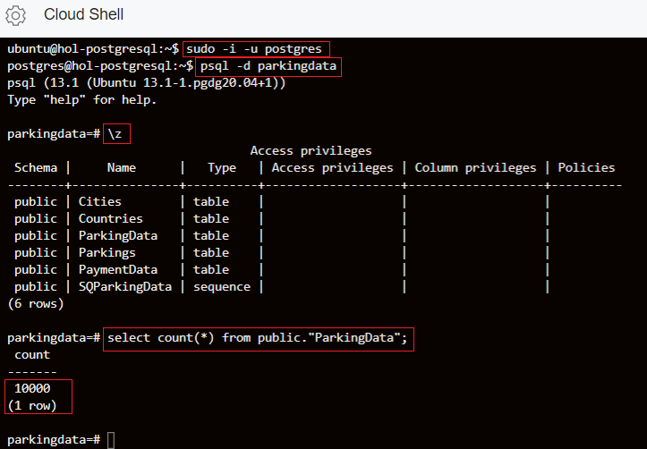

Let's proceed to next lab.

- [Go to next lab 3](step3.md)
