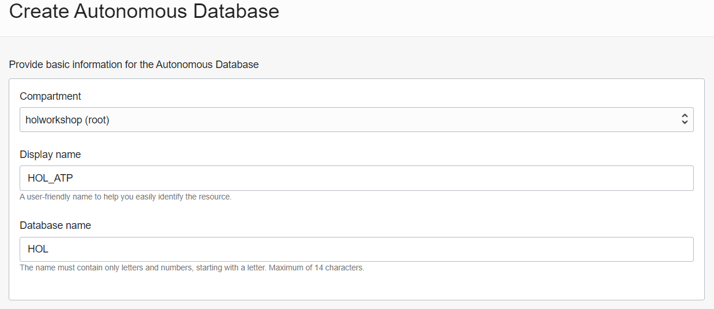
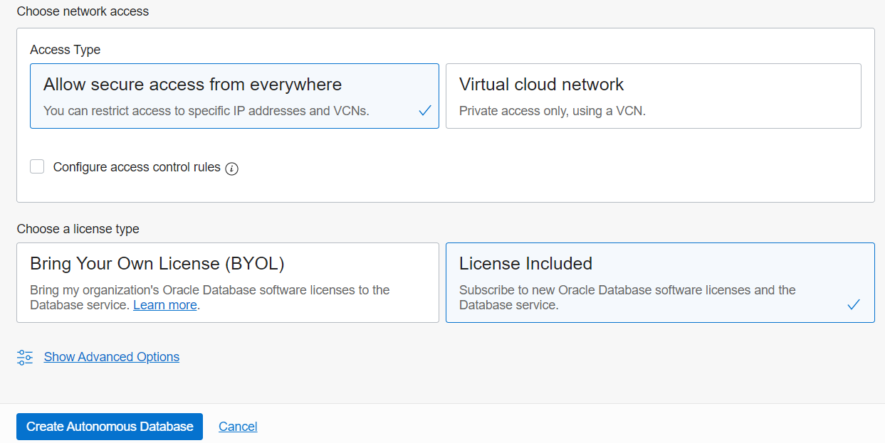

- [Go back to main](README.md)
- [Go back to previous step](step2.md)

# Lab 3 - Create your target Autonomous Database

#### What deployment options are available for Autonomous Database?

There are 2 options for deploying an autonomous database.
- Serverless deployment. In serverless deployment, multiple users share the same cloud infrastructure resources. Serverless deployment is the simplest option; it requires no minimum commitment and users can take advantage of quick data provisioning and application development. Users also enjoy independent compute and storage scalability. In this deployment model, users are responsible for database provisioning and management while the provider takes care of infrastructure deployment and management responsibilities.
- Dedicated deployment. Dedicated deployment allows the user to provision the autonomous database within a dedicated (unshared) cloud infrastructure. This deployment model has no shared processor, memory, network, or storage resources. Dedicated deployment offers greater control and customization over the entire environment and is ideal for users who want to tailor their autonomous database to meet specific organizational needs. Additionally, dedicated deployment allows for an easy transition from on-premise databases to a fully autonomous and isolated private database cloud.

#### What type of workloads can your run in an Autonomous Database?

An autonomous database consists of three key elements that align with workload types.
- Data warehouse performs numerous functions related to business intelligence activities, and uses data that’s been prepared in advance for analysis. The data warehouse environment also manages all database lifecycle operations, can perform query scans on millions of rows, is scalable to business needs, and can be deployed in a matter of seconds.

- Transaction processing enables time-based transactional processes such as real-time analytics, personalization, and fraud detection. Transaction processing typically involves a very small number of records, is based on predefined operations, and allows for simple application development and deployment.

- JSON Database ... explanation 

## PART 1: Create your Autonomous Database

Let's continue from the previous lab. Go to top left hamburger icon, navigate to **Autonomous Transaction Processing**, then choose your compartment from left pane and click on **Create Autonomous Database** button.

#### Create ATP
Configuration page will open, confirm your compartment once again. Then give a name for deployment **HOL_ATP** and give a database name **HOL**

#### Workload type

We will choose **Transaction Processing** workload type and will use **Shared Infrastructure**.

#### Option 1: Always free
Here, if you'd like to create your ATP as **Always Free**, which is free forever but with limited CPU and storage capacity. Just click on this toggle. **Note: You cannot scale up or down Always Free resource after creation**

#### Option 2: Non-Limited
If you want more power and able to be scale up/down your resource at later stage, choose to disable Always free. For this lab, keep auto scaling disabled and you can change this anytime.
Number of **OCPU** count for your ATP, let's specify just 1 and **Storage** 1 TB also, we can change this anytime after instance creation.

#### Admin password
Provide your ADMIN account credentials here, for example **GG##lab12345** will suffice password requirement.

#### Network Access and License
We will accept the default option for network access, "Allow secure access from everywhere". For license type, select **License Included**, because we want to subscribe to new database software licenses and the database cloud service.

Review everything and click on **Create Autonomous Database**.

#### Provisioning
Your instance will begin provisioning. In a few minutes, the state will turn from Provisioning to Available. At this point, your Autonomous Data Warehouse database is ready to use! Have a look at your instance's details here including its name, database version, OCPU count, and storage size.

#### Created
It takes only 2-5 minutes to create fully working highly available, self running Autonomous database.

## PART 2
This part will run create target tables for GG migration and enable GG replication in Autonomous database.

#### SQL developer web 

In **Tools** tab, where you can access to SQL Developer Web and other web tools. Click **Open SQL Developer Web**, you may need to enable pop-up your browser if it doesn't open anything.

A new sign-in page opens, enter **ADMIN** in Username and enter your password.

#### Create target tables

When you open the SQL Developer Web for first time, a series of pop-up informational boxes introduce you to the main features. Take a quick look at them. 

Let's create our target tables for migration. Please download target table creation script **[from here](./files/atp/CreateTables.sql)**. Make sure to save these with correct extension .sql not txt!

SQL Developer Web opens a worksheet tab, where you execute queries. Drag your downloaded CreateTables.sql and drop in the worksheet area. Then run create statements.

#### Enable GGADMIN 

Now let's unlock and change the password for the pre-created Oracle GoldenGate user (ggadmin) in Autonomous Database.
Run `alter user ggadmin identified by "GG##lab12345" account unlock;`

Let's just check whether the parameter enable_goldengate_replicaton is set to true, for some case it maybe set to false.

Run `alter system set enable_goldengate_replication = true scope=both;`

We successfully provisioned our Autonomous Database and run necessary pre-requisite steps for later stages.

- [Go to next lab 4](step4.md)
