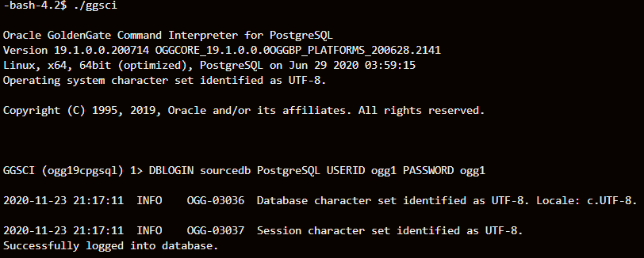

#### Some necessary packages

```
sudo rpm -Uvh https://yum.postgresql.org/12/redhat/rhel-7-x86_64/pgdg-redhat-repo-latest.noarch.rpm
sudo yum install postgresql11-contrib -y 
sudo yum install postgresql12-contrib -y 
sudo yum install libpq -y
sudo yum install postgresql-odbc.x86_64 -y
```
#### Configure ODBC connection to PostgreSQL

Create odbc.ini file in ogg installation location, issue:
vi /home/opc/postgresql/odbc.ini

Refer to the following example:
```
[ODBC Data Sources]
PostgreSQL=DataDirect 7.1 PostgreSQL Wire Protocol
[ODBC]
IANAAppCodePage=4
InstallDir=/home/opc/postgresql
[PostgreSQL]
Description=Test to Postgres
Driver=/home/opc/postgresql/lib/GGpsql25.so
Database=dvdrental
Servername=130.61.102.204
UserName=ogg1
Password=ogg1
Port=5432
```
LIBPQ (PostgreSQL installation/lib) and data direct library (dd_odbc_home/lib) are required, so you need to set the LD_LIBRARY_PATH.

```
export ODBCINI=/home/opc/postgresql/odbc.ini
export LD_LIBRARY_PATH=/home/opc/postgresql/lib:/usr/lib64:$LD_LIBRARY_PATH
```
#### Run GGSCI

To start GGSCI, execute the following command:

  ```./ggsci```
  
Run the following command to log into the database:

```DBLOGIN sourcedb PostgreSQL USERID ogg1 PASSWORD ogg1```



You should be able to see above information.

#### Registering a Replication Slot

Oracle GoldenGate needs to register the extract with the database replication slot.

Before registering the Extract, ensure to have the DBLOGIN connected to the source database.
For example, if the Extract group name is extr, then run the following command from GGSCI to register the Extract:
